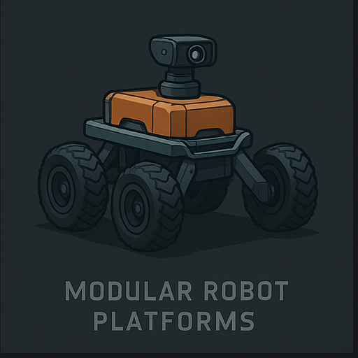
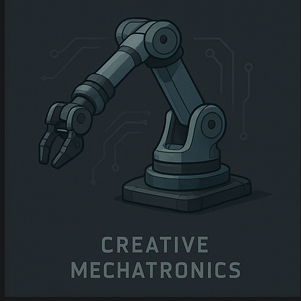
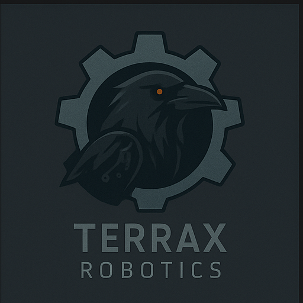
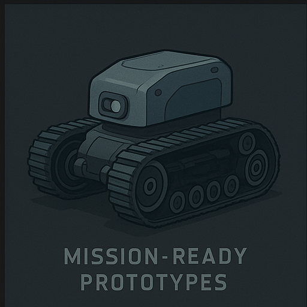

# Terrax Robotics

**Modular robots. Field-ready design. Human-centered engineering.**

Terrax Robotics is a small independent engineering team based in Germany.  
We focus on modular robot platforms, creative mechatronics, and mission-ready prototypes.

We believe in learning by building, and in building with purpose.  
Every machine we create carries our signature: curiosity and solder.

---

### 🔧 Current Project

**TRX-01** – a modular tracked bot based on the Actobotics system.  
Designed for remote exploration, sensor testing, and system resilience.

---
### 📡 Terrax Robotics Concepts
| Modular Rover | Robotic Arm |
|---------------|-------------|
|  |  |

| Raven Emblem | TRX-01 Prototype |
|--------------|------------------|
|  |  |

**🌐 Website:** [terrax-robotics.com](https://terrax-robotics.com)  
**📩 Contact:** [info@terrax-robotics.com](mailto:info@terrax-robotics.com)
